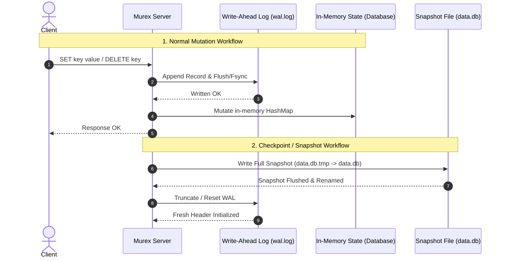
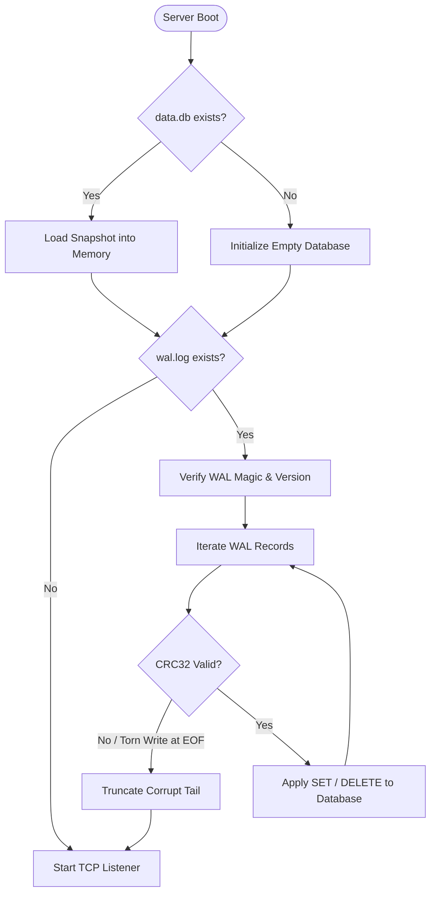

# RFC-0006: Write-Ahead Log (WAL) & Crash Recovery

* **Status:** Accepted
* **Created:** 2026-09-03
* **Category:** Storage & Persistence
* **Target Milestone:** Milestone 3 (v0.3.0)

---

# 1. Summary

This RFC specifies the architecture, binary frame layout, durability synchronization models, and startup crash-recovery algorithms for the **MurexDB Write-Ahead Log (WAL)**.

The WAL provides durable write logging before mutating operations (`SET`, `DELETE`) are applied to the in-memory `Database` state or acknowledged to clients. In the event of a sudden process termination (`SIGKILL`), crash, or hardware power failure, MurexDB restores full data integrity by combining the baseline snapshot (`data.db`) with an append-only log replay (`wal.log`).

---

# 2. Motivation

In Milestone 2 (RFC-0005), MurexDB introduced binary snapshot persistence. However, snapshots have inherent limitations when used alone:

1. **Data Loss Window:** Snapshots are written periodically or during graceful shutdown. Any unexpected crash loses all mutations executed after the last snapshot.
2. **High Snapshot Cost:** Re-serializing the entire database on every write command is $O(N)$ with respect to dataset size and impractical for high-write workloads.

A **Write-Ahead Log** provides:
* **$O(1)$ Append-Only Writes:** Mutations are serialized and appended to disk sequentially without rewriting existing state.
* **Zero / Bounded Data Loss:** Every acknowledged transaction is secured on persistent storage.
* **Fast Crash Recovery:** Server boot applies the latest snapshot and replays only the delta records recorded in the WAL.
* **Data Integrity Verification:** Per-record CRC32 checksums detect bit rot, torn writes, or mid-record power failures.

---

# 3. WAL File & Record Layout Specification

The Write-Ahead Log is stored as a single append-only binary file (`wal.log`).

```text
 0                   1                   2                   3
 0 1 2 3 4 5 6 7 8 9 0 1 2 3 4 5 6 7 8 9 0 1 2 3 4 5 6 7 8 9 0 1
+-+-+-+-+-+-+-+-+-+-+-+-+-+-+-+-+-+-+-+-+-+-+-+-+-+-+-+-+-+-+-+-+
|                     Magic Bytes ("MXWL")                      |
+-+-+-+-+-+-+-+-+-+-+-+-+-+-+-+-+-+-+-+-+-+-+-+-+-+-+-+-+-+-+-+-+
|         Version (u16)         |           Reserved            |
+-+-+-+-+-+-+-+-+-+-+-+-+-+-+-+-+-+-+-+-+-+-+-+-+-+-+-+-+-+-+-+-+
|                   WAL Record 1 (Framed)                       |
|                            ...                                |
+-+-+-+-+-+-+-+-+-+-+-+-+-+-+-+-+-+-+-+-+-+-+-+-+-+-+-+-+-+-+-+-+
|                   WAL Record N (Framed)                       |
|                            ...                                |
+-+-+-+-+-+-+-+-+-+-+-+-+-+-+-+-+-+-+-+-+-+-+-+-+-+-+-+-+-+-+-+-+
```

## 3.1 WAL File Header (8 Bytes)

The WAL file begins with an 8-byte immutable header created when the log is initialized:

| Field | Size | Type | Value / Description |
| :--- | :--- | :--- | :--- |
| **Magic Bytes** | 4 Bytes | `[u8; 4]` | `[0x4D, 0x58, 0x57, 0x4C]` (ASCII `"MXWL"`) |
| **Version** | 2 Bytes | `u16 BE` | `0x0001` (Version 1) |
| **Reserved** | 2 Bytes | `[u8; 2]` | `0x0000` (Reserved for future flags / compression) |

---

## 3.2 Individual WAL Record Layout

Every mutation appended to the log follows a strict length-prefixed, checksum-protected frame:

```text
 0                   1                   2                   3
 0 1 2 3 4 5 6 7 8 9 0 1 2 3 4 5 6 7 8 9 0 1 2 3 4 5 6 7 8 9 0 1
+-+-+-+-+-+-+-+-+-+-+-+-+-+-+-+-+-+-+-+-+-+-+-+-+-+-+-+-+-+-+-+-+
|                         CRC32 (u32)                           |
+-+-+-+-+-+-+-+-+-+-+-+-+-+-+-+-+-+-+-+-+-+-+-+-+-+-+-+-+-+-+-+-+
|                                                               |
+                      LSN / Sequence (u64)                     +
|                                                               |
+-+-+-+-+-+-+-+-+-+-+-+-+-+-+-+-+-+-+-+-+-+-+-+-+-+-+-+-+-+-+-+-+
|    OpCode     |        Key Length (u16)       |  Val Len (u32)|
+-+-+-+-+-+-+-+-+-+-+-+-+-+-+-+-+-+-+-+-+-+-+-+-+-+-+-+-+-+-+-+-+
|  Val Len cont |             Key Bytes (Key Length)            |
+-+-+-+-+-+-+-+-+-+-+-+-+-+-+-+-+-+-+-+-+-+-+-+-+-+-+-+-+-+-+-+-+
|                            ...                                |
+-+-+-+-+-+-+-+-+-+-+-+-+-+-+-+-+-+-+-+-+-+-+-+-+-+-+-+-+-+-+-+-+
|                    Value Bytes (Value Length)                 |
|                            ...                                |
+-+-+-+-+-+-+-+-+-+-+-+-+-+-+-+-+-+-+-+-+-+-+-+-+-+-+-+-+-+-+-+-+
```

### Record Header Fields Breakdown:

| Field | Size | Type | Description |
| :--- | :--- | :--- | :--- |
| **CRC32** | 4 Bytes | `u32 BE` | IEEE 802.3 CRC32 checksum computed over `[LSN..Payload End]`. |
| **LSN** | 8 Bytes | `u64 BE` | Log Sequence Number (monotonically increasing 64-bit integer). |
| **OpCode** | 1 Byte | `u8` | Operation type: `0x01` (`SET`), `0x02` (`DELETE`). |
| **Key Length** | 2 Bytes | `u16 BE` | Length of the key in bytes ($0 < \text{len} \le 65,535$). |
| **Value Length** | 4 Bytes | `u32 BE` | Length of the value in bytes ($0$ for `DELETE`, $\le 67,108,864$ for `SET`). |
| **Key Bytes** | Variable | `[u8]` | Binary key slice of length `Key Length`. |
| **Value Bytes** | Variable | `[u8]` | Binary value slice of length `Value Length` (omitted if `Value Length == 0`). |

---

# 4. WAL Mutation & Checkpoint Workflow



## 4.1 Mutation Write Path
1. The client sends a write request (`SET` or `DELETE`).
2. Server increments internal atomic `LSN` counter.
3. Server encodes the WAL record and calculates the CRC32 checksum.
4. Server appends the record to the append-only `wal.log` buffer and executes disk sync (`fsync`/`fdatasync`).
5. Server updates the in-memory `Database` state (`RwLock<HashMap<Key, Value>>`).
6. Server sends the success response frame back to the client.

> **Durability Invariant:** An in-memory mutation is never applied until the corresponding WAL entry has been reliably written to non-volatile storage.

## 4.2 Checkpointing & WAL Truncation
As the WAL grows, replay time on startup increases and disk space accumulates. When a snapshot is created:
1. Server takes an atomic snapshot of in-memory state into `data.db` (via RFC-0005).
2. Once `data.db` is successfully synced to disk, all preceding WAL records are redundant.
3. Server truncates `wal.log` (resets file length to 8 bytes containing the File Header) and resets/records the current base LSN.

---

# 5. Crash Recovery Protocol

When `murex-server` boots:



### 5.1 Recovery Steps:
1. **Load Base Snapshot:** If `data.db` exists, load baseline entries using `load_snapshot()` (RFC-0005). If not, start with an empty map.
2. **Inspect WAL:** If `wal.log` does not exist or is empty, create a new `wal.log` with the 8-byte header and proceed to accept connections.
3. **Verify Header:** Read and validate the first 8 bytes (`"MXWL"`, version `1`). If header is corrupted, abort with fatal error.
4. **Sequential Replay:**
   - Read record: CRC32, LSN, OpCode, Key Length, Value Length, Key, Value.
   - Recompute CRC32 over the read payload.
   - If CRC32 matches:
     - `OpCode == 0x01 (SET)`: Insert `(key, value)` into `Database`.
     - `OpCode == 0x02 (DELETE)`: Remove `key` from `Database`.
   - Update last observed `LSN`.
5. **Handling Torn Writes / Power Cuts at EOF:**
   - If EOF is reached cleanly: All transactions recovered.
   - If an unexpected EOF or CRC32 mismatch occurs on the final record (caused by power loss mid-write):
     - Log warning detailing incomplete transaction at EOF.
     - Truncate the file to the end of the last valid record.
6. **Ready for Service:** Update the server's next LSN to `last_lsn + 1` and open the TCP listener.

---

# 6. Synchronization Strategies (`FsyncMode`)

To balance throughput and durability requirements, MurexDB supports configurable sync policies:

| Mode | Configuration | Behavior | Guarantees |
| :--- | :--- | :--- | :--- |
| **`Always` (Default)** | `MUREX_WAL_SYNC=always` | Calls `sync_data()` after every single write. | Full zero-data-loss durability. |
| **`Interval`** | `MUREX_WAL_SYNC=interval:100ms` | Writes to OS page cache; flushes to disk periodically in background task. | High throughput; max 100ms data loss on crash. |
| **`Never / OS`** | `MUREX_WAL_SYNC=none` | Relies entirely on OS page cache writeback. | Maximum throughput; data loss bounded by OS sync interval. |

---

# 7. Error Handling & Bounds Checking

1. **Magic Bytes Mismatch:** Return `MurexError::InvalidFrame("Invalid WAL magic bytes")`.
2. **Key / Value Size Limit:** Enforce `key_len <= 65,535` and `val_len <= 67,108,864`.
3. **Corrupted Record:** If a CRC32 mismatch occurs in the middle of a file (prior to EOF), fail startup with a corruption error preventing silent data loss.
4. **Disk Full:** Propagate `std::io::ErrorKind::StorageFull` to client as `ERR_SERVER_ERROR`.

---

# 8. Proposed Rust API & Architecture

```rust
// crates/server/src/wal.rs

pub struct WalWriter {
    file: std::fs::File,
    next_lsn: u64,
    sync_mode: FsyncMode,
}

pub struct WalReader<R> {
    reader: R,
}

#[derive(Debug, Clone, PartialEq, Eq)]
pub enum WalRecord {
    Set { lsn: u64, key: Vec<u8>, value: Vec<u8> },
    Delete { lsn: u64, key: Vec<u8> },
}

impl WalWriter {
    pub fn open<P: AsRef<Path>>(path: P) -> Result<Self>;
    pub fn append_set(&mut self, key: &[u8], value: &[u8]) -> Result<u64>;
    pub fn append_delete(&mut self, key: &[u8]) -> Result<u64>;
    pub fn checkpoint<P: AsRef<Path>>(path: P) -> Result<Self>;
}

impl<R: std::io::Read> WalReader<R> {
    pub fn new(reader: R) -> Result<Self>;
    pub fn replay_into(&mut self, db: &Database) -> Result<usize>;
}
```

---

# 9. Related Documents

* `ROADMAP.md`
* `rfcs/RFC-0002-network-protocol.md`
* `rfcs/RFC-0004-concurrency-model.md`
* `rfcs/RFC-0005-storage-persistence.md`
